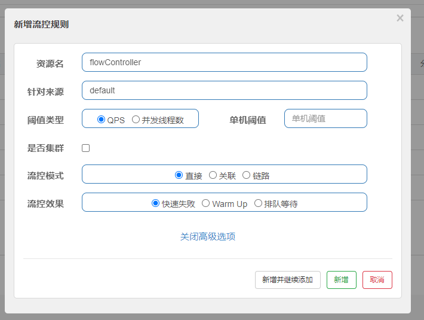

# Sentinel限流组件

>  主要功能为流量控制、熔断降级、系统自适应保护、热点防护

## 介绍
1. **丰富的应用场景**：Sentinel由阿里开源并维护，扛过双11流量，消息削峰填谷、集群流量控制、实时熔断下游不可用应用
1. **完备的实时监控**：管控提供秒级实时的监控功能，甚至 500 台以下规模的集群的汇总运行情况
1. **广泛的开源生态**: 提供开箱即用的与其它开源框架 / 库的整合模块,Spring Cloud、Dubbo等快速接入能力

## Sentinel 基本概念
#### 资源
资源是 Sentinel 的关键概念。它可以是 Java 应用程序中的**任何内容**，可以是一个服务，一个微服务，甚至一段代码，本文下述资源指代码块

#### 规则
规则是指对资源的控制规则，可以包括流量控制规则、熔断降级规则以及系统保护规则，可动态配置

## 快速快速
sentinel可以分为两部分，控制端和客户端

**控制端**：一个jar包，可单独运行，运行后可以访问到管控页面

**客户端**：即代码集成，在启动时需要设置VM参数

    -Dcsp.sentinel.dashboard.server=localhost:8088

### 搭建过程

#### 下载管控jar包
[sentinel-http](https://github.com/alibaba/Sentinel/releases)
####运行
serverPort表示sentinel运行的端口，dashboard.server表示管控的地址

    java -Dserver.port=8088 -Dcsp.sentinel.dashboard.server=localhost:8088 -Dproject.name=sentinel-dashboard -jar  .\sentinel-dashboard-1.8.4.jar
   
#### 查看
打开浏览器访问上述配置的地址可以访问，默认账号密码为sentinel

####
加入依赖

    <dependency>
            <groupId>com.alibaba.csp</groupId>
            <artifactId>sentinel-transport-simple-http</artifactId>
            <version>1.8.0</version>
        </dependency>
        <dependency>
        <groupId>com.alibaba.cloud</groupId>
        <artifactId>spring-cloud-starter-alibaba-sentinel</artifactId>
        <version>2021.1</version>
        </dependency>

配合web开发，加入web依赖
    
    <dependency>
        <groupId>org.springframework.boot</groupId>
        <artifactId>spring-boot-starter-web</artifactId>
    </dependency>
---
    @GetMapping(value = "/flowController")
    public AjaxResult apiFlowControl() {
        return AjaxResult.success(service.flowController("限流"));
    }
在管控界面设置规则(具体配置详情请看下文)

由于规则是懒加载，所以在项目启动时并不会看见资源在列表内，需要触发一次请求

用接口测试工具进行测试

正常情况

限流情况
用默认的管控配置，会抛一个FlowException，并且没有后续处理流程，就会在接口返回null

可以看到资源的流量情况，QPS被限定在了设置的阈值2个，其他请求将会被拒绝

## 规则配置

对于规则配置，有3种方法
- 管控配置

- 代码配置

- 持久化配置

### 管控配置
显而易见，在控制台的资源管理页面，可以配置限流，熔断，热点

**规则配置存放于内存，所以每次重启，都会丢失，所以在生产环境这样是不现实的**

#### 流控配置

默认策略是直接+快速失败

资源名： 表示一段代码或一个服务(注：一定要完全一样，比如/flowController与flowController就是2个完全不同的资源)

阈值类型： QPS与并发线程数，QPS(每秒查询率),并发线程数即并发线程数

单机阈值： 出现流控效果所需要达到的阈值

流控模式： 
- 直接：对该资源的直接控制

- 关联：有竞争同资源的2个接口，可以保护某接口，如订单服务有读订单A与写订单B两个接口，B比较重要，那么当A接口的流量超过阈值，就会限制A，把处理性能分配给B，保证能先收钱

- 链路：只控制从某入口进来访问该资源的请求，如查询订单与创建订单都需要访问查询商品这个资源，那么可以单独配置查询订单-查询商品这一路径的流控

流控效果：
- 快速失败: 当达到阈值时，拒接新请求并直接抛出FlowException

- Warm Up: 预热模式，阈值会动态变化，从一个较小值逐渐增加到最大阈值，达到最大后也是拒绝+抛异常

- 排队等待: 当达到阈值后，请求会进行排队匀速通过，如果等待超过设置的时间则拒绝

#### 熔断配置
熔断是保护系统的一种方式，也称为服务降级，默认策略是抛出BlockException

熔断策略: 
- 慢调用比例：访问资源的时间ms,当在下一个统计时长内，最小请求数中达到比例阈值后熔断设置的时长
  
  如图设置，表示当有请求超过500ms时，触发统计，在接下来的2000ms内，如果6个请求中有50%即3个请求都超过500ms,则熔断1000ms，在接下来的1000ms内的请求都会直接抛出BlockException

- 异常比例：与上图一样只是少了最大RT，含义也类似，即在统计时间内异常比例超过阈值就触发熔断

- 异常数：同上，异常比例换为异常数 

#### 热点配置
当带有特定参数的某个请求到达阈值，则会触发限流，抛出ParamFlowException
使用场景：某用户高频访问，某地区的高频活动，某商品的高频访问等进行限制

### 代码配置
代码配置主要由Rule类实现

~~~

//流控规则配置
List<FlowRule> rules = new ArrayList<>();
//资源名
FlowRule rule = new FlowRule("sendMessageWithAnnotation");
// QPS 2
rule.setCount(2);
//流控类型，QPS or 线程数
rule.setGrade(RuleConstant.FLOW_GRADE_QPS);
rule.setLimitApp("default");
//最大等待时间
rule.setMaxQueueingTimeMs(10);
//流控策略 0直接 1关联 2链路
rule.setStrategy(0);
//流控效果 0直接拒绝 1WarmUp 2匀速排队等待
rule.setControlBehavior(0);
rules.add(rule);
FlowRuleManager.loadRules(rules);

//熔断配置
List<DegradeRule> rules = new ArrayList<>();
DegradeRule rule = new DegradeRule("/circuitBreakingByRt");
//阈值数值
rule.setCount(500);
//熔断类型 0慢调用，1异常率，2异常数
rule.setGrade(RuleConstant.DEGRADE_GRADE_RT);
//最小请求数
rule.setMinRequestAmount(6);
//熔断时间ms
rule.setTimeWindow(1000);
//统计时间
rule.setStatIntervalMs(2000);
rules.add(rule);
DegradeRuleManager.loadRules(rules);
~~~

在项目启动时注入到容器，当触发该资源的第一次请求时，规则就会自动配置在管控上，可以在管控实时修改

但是修改后并不会持久化，所以需要引入nacos

~~~
##依赖

<dependency>
    <groupId>com.alibaba.csp</groupId>
    <artifactId>sentinel-datasource-nacos</artifactId>
    <version>*.*.*</version>
</dependency>

##配置文件

spring:
  cloud:
    #配置sentinel客户端，注册该项目进控制台里
    sentinel:
      eager: true
      transport:
        #配置Sentinel dashboard地址
        dashboard: localhost:8088
        # 默认8719端口，假如被占用了会自动从8719端口+1进行扫描，直到找到未被占用的 端口
        port: 8719
      #nacos  从nacos拉取数据需要配置
      datasource:
        #名称随意
        flow:
          nacos:
            server-addr: 192.168.1.11:8848
            data_id: ${spring.application.name}-flow-rules
            namespace: sentinel
            group_id: SENTINEL_GROUP
            rule-type: flow
~~~

##资源定义

sentinel默认对所有url都进行了默认定义，即所有@RequestMapping及子类注解的URL都会默认加载为资源

资源定义有2种方式

- 注解

  @SentinelResource将方法标记为资源
  
  feedback：表示最后的兜底方法，对所有异常进行处理
  blockHandler：表示对sentinel触发的异常进行处理，如BlockException
  

  
      @SentinelResource(value = "sendMessageWithAnnotation",blockHandler = "blockHandler",feedback = "feedbackHandler")
     
- 硬编码
~~~
//类似于获得锁
 Entry entry = null;
        try {
          //定义一个资源
            entry = SphU.entry( "sendMessageWithAnnotation");
                kafkaTemplate.send(topic, message.toString());
                return 1;
        } catch (BlockException e) {
        //如果被限流或熔断，会进入这里
        //可以请求延期，削峰填谷，睡眠一会，防止消息一直进入队列
            Thread.sleep(1000);
             //重试机制或失败机制
            throw new GlobalException("限流了...");
        }
        finally {
        //退出竞争资源
            if (null != entry) {
                entry.exit();
            }
        }
~~~

#### 异常处理
~~~
    public AjaxResult blockHandler(BlockException blockException) {
        return AjaxResult.error("block自定义异常") ;
    }

~~~
@SentinelResource注解 里的 blockHandle的值是方法名，必须是同类的public方法，并且参数个数和返回类型，并且value的值一定要和配置的资源名称一致，可以多加一个BlockException的参数，否则就会失效

## 配合kafka实现削峰填谷
可以把生产消息与消费消息的方法都看做是资源，只要配置资源的控制就可以达到控制消息的生产与消费

此处实验有坑

在实现kafka生产者发送消息的切面

实现ProducerInterceptor接口，然后把实现类注入到kafka初始化的配置类中

~~~
@Component
public class SentinelHandlerInterceptor implements ProducerInterceptor<String,Object> {

    @Override
    public ProducerRecord onSend(ProducerRecord producerRecord) {
        Entry entry = null;
        try {
            entry = SphU.entry( "sendMessage");
            return producerRecord;
        } catch (BlockException e) {
            //睡眠一会，防止消息一直进入队列
            System.out.println("限流了");
            try {
                Thread.sleep(1000);
            } catch (InterruptedException interruptedException) {
                System.out.println("中断异常");
            }
            //此处抛异常将无法被sentinel捕获，所以即使发消息时限流了
            //抛了BlockException，也不会被理会，消息还是可以直接发送成功
            //原因在于切面interceptor可能被运行在多个线程中
            //并仅仅是捕获每个interceptor可能抛出的异常记录到错误日志中而非在向上传递
            return null;
            //throw new GlobalException("限流了...");
        }
        finally {
            if (null != entry) {
                entry.exit();
            }
        }
    }

    @Override
    public void onAcknowledgement(RecordMetadata recordMetadata, Exception e) {}
    @Override
    public void close() {}
    @Override
    public void configure(Map<String, ?> map) {}
}

/** 注入切面 */

    @Bean
    @Autowired
    public KafkaTemplate<String,String> kafkaTemplate(ProducerFactory<String,String> producerFactory){
        ArrayList<String> interceptors = new ArrayList<>();
        interceptors.add("com.seerbigdata.sentinel.interceptor.SentinelHandlerInterceptor");
        Map<String, Object> configMap = new HashMap<>();
        configMap.put(ProducerConfig.INTERCEPTOR_CLASSES_CONFIG,interceptors);
        producerFactory.updateConfigs(configMap);

        return new KafkaTemplate<>(producerFactory);
    }
~~~

由于切面对所有生产的消息都控制并且异常不能控制，所以可以考虑单独控制生产、消费消息的资源

## 注意事项
1. springboot版本与sentinel版本与sentinel控制台版本有对应的关系，注意版本的关联，否则会出现启动报找不到类的异常

